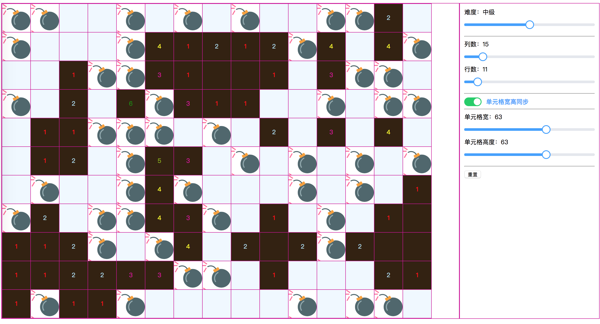

# minegame for fun

it's a minegame for fun, power by vue.

game image



## Project setup

```sh
yarn install
```

### Compiles and hot-reloads for development

```sh
yarn run serve
```

### Compiles and minifies for production

```sh
yarn run build
```

### Lints and fixes files

```sh
yarn run lint
```

### Run your unit tests

```sh
yarn run test:unit
```
